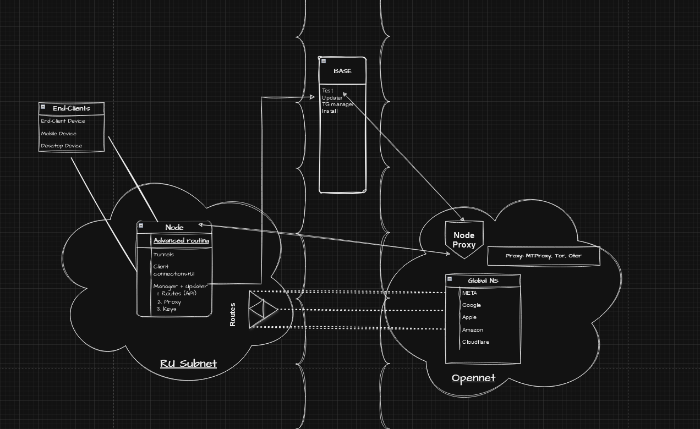

# README #

## Advanced routing

* AntiDPI
* MergeNamespaces
* Trust:
  Routes
  Testing proxies
* Allows classic VPNs to continue working
* Fast Virtualization

### Installation ###

With script or telegram bot

List of packages:

- resolvconf
- badvpn, tun2socks
- v2ray

Apply:

- dnssec
- dnsmasq list
- At least one proxy
- Routes
- Cron jobs

### Contents ###

* NodeSocket code (Flask+gRPC)
* Updater scripts
* API guideline
* TG bots: install and managing
* Test scripts
